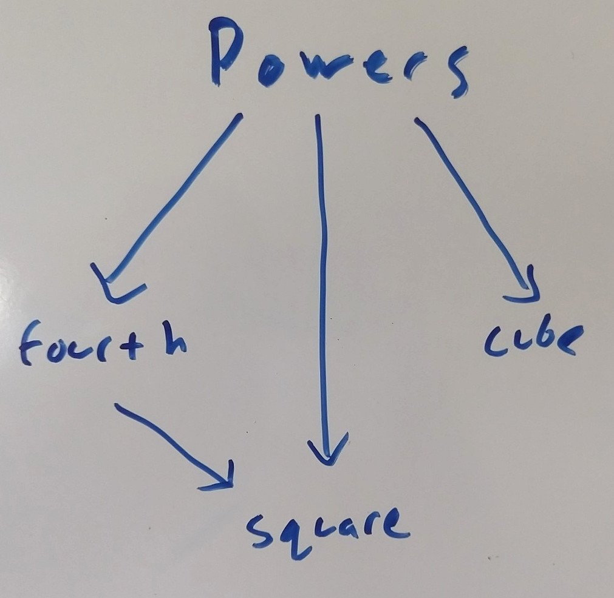

# Powers Example Project

This example project calculates the 32, 33, and 34. It is pretty basic rholang, but it illustrates the power of rhopm.

## Dependency Structure

The main program lives in `powers.rho`. Powers imports three helper contracts from the `math` directory to compute each of the three exponents. Some of these helpers also have internal dependencies as illustrated.

The package manager calculates this graph, deploys the dependencies in the correct order, a only deploys a single instance of `square` which both `fourth` and `power` have access to.

## Basic Usage

Spin up a node with casper. That isn't trivial atm, but check out [nth-caller](https://github.com/JoshOrndorff/nth-caller-game) and its [npm run fresh](https://github.com/JoshOrndorff/nth-caller-game/blob/master/package.json#L8) for one way to do it.

To deploy the code execute `node rhopm.js --package powers.rho`

Notice that everything ran as expected. Running the command like that didn't save any info about where contracts were deployed, so they cannot be reused in the future.

## Saving Deployment URIs
To save deployment URIs in a directory file, specify a file like this.

`node rhopm.js --package powers.rho --directory uris.json`

The output is basically the same, but you now have a `uris.json` file that remembers where your contracts were deployed on the chain. To see the power of saving this information, run the deployment one more time.

`node rhopm.js --package powers.rho --directory uris.json`

This time none of the dependencies are deployed because they already exist on-chain. Only the thing deployed this time is the main program `powers.rho`.

Remember to delete the `uris.json` when you kill your node or you'll be a sad panda.
